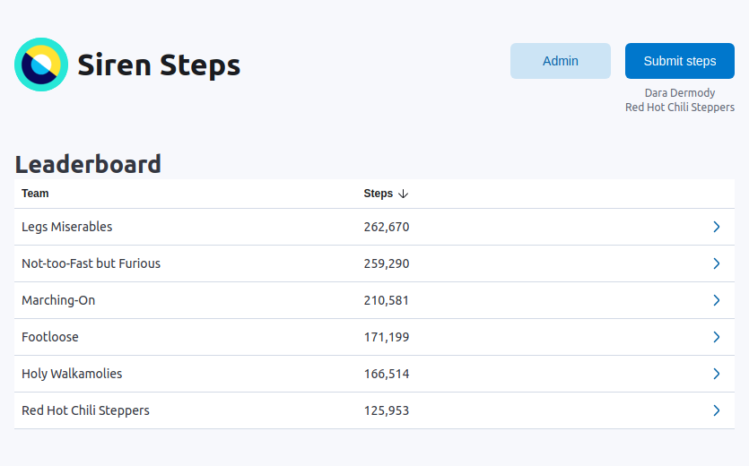
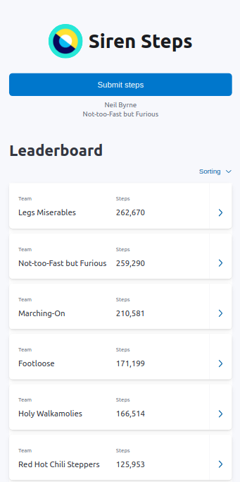

Siren Steps is a web app where groups of people can compete to walk the most.

<p align="center">
  
</p>
<p align="center">
  
</p>

## Development

To run locally, use:
```bash
yarn start
# Or with Docker:
yarn docker:start
```

To build and publish, run:
```
docker:build
docker:publish
```
